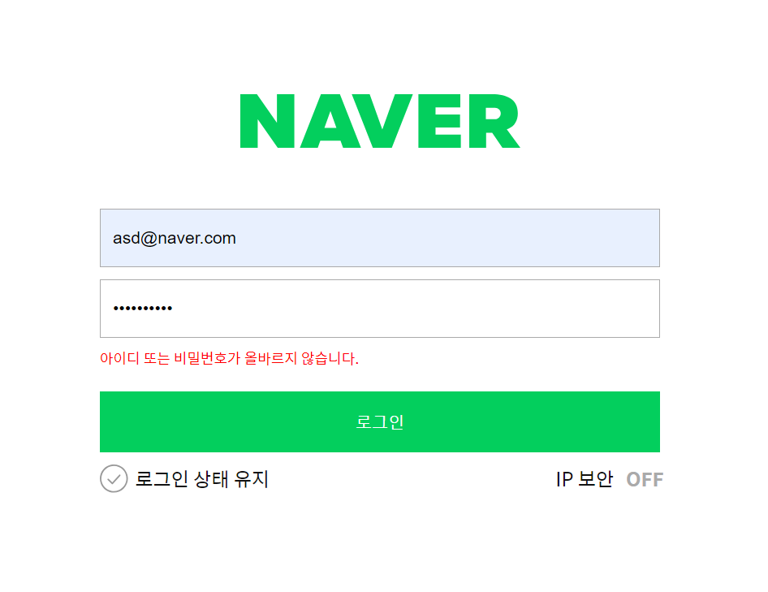

# 네이버 로그인 페이지 구현

<!-- ---

로그인과 비밀번호를 정확히 입력했을 때 welcome 페이지로 넘어갈 수 있도록 코드 로직을 작성합니다.


---
- [x] 재사용 가능한 함수를 분리하고 함수를 중심으로 설계하는 방법에 대해 학습합니다. -->

## Mission-1

- 일치하는 아이디와 비밀번호를 입력했을 경우, welcome페이지로 이동하는 코드 로직을 작성해주세요.

### 요구사항에 따른 처리사항

- email & pw 정규표현식을 사용한 validation 조건처리

```js
const emailInput = document.getElementById("userEmail");
const pwInput = document.getElementById("userPassword");

const isEmailValid = emailReg(emailInput.value);
const isPwValid = pwReg(pwInput.value);

// 1. email 정규표현식을 사용한 validation
if (!isEmailValid) {
  emailInput.classList.add("is--invalid");
} else {
  emailInput.classList.remove("is--invalid");
}

// 2. pw 정규표현식을 사용한 validation
if (!isPwValid) {
  pwInput.classList.add("is--invalid");
} else {
  pwInput.classList.remove("is--invalid");
}
```

- 로그인 버튼을 클릭시 user.id의 값과 input의 값을, user.pw의 값과 input의 값을 비교. 그리고 두 값이 일치한다면 다음페이지(welcome.html)로 이동

```js
const emailInput = document.getElementById("userEmail");
const pwInput = document.getElementById("userPassword");
const loginFailedMessage = document.getElementById("login-failed");

if (validInput()) {
  if (emailInput.value === user.id && pwInput.value === user.pw) {
    window.location.href = "welcome.html";
  } else {
    loginFailedMessage.classList.add("login-failed-message-visible");
  }
} else {
  loginFailedMessage.classList.remove("login-failed-message-visible");
}
```

### 그 외 추가 사항

1. ID&PW 형식은 지켰지만 틀렸을 경우
   

&emsp;위 사진과 같은 결과를 만들기 위해 index.html엔 추가적인 `<span>`을, style.css엔 해당 span의 스타일을 지정했습니다.

> &emsp;처음엔 js를 활용하여 textContent로 조정하고 display 또한 none이나 block으로 조정하도록 하려하였으나, 이러한 직접적인 조작보다는 html에 추가적인 클래스를 할당하고, css로 최대한 세팅하고, 수업시간에 배운 classList 조작을 통해 간단하게 다루는 방식이 제일 안전하면서도 합당하다 생각하여 이와 같이 진행하였습니다.

#### index.html

```html
<div class="user-password">
  ...(중략)

  <span class="error-message" id="userPasswordError">비밀번호는 특수문자 포함 6자리 이상 입력해 주세요.</span>
  <!-- 아이디, 비번이 달라 뜨는 오류메시지 -->
  <span class="error-message" id="login-failed">아이디 또는 비밀번호가 올바르지 않습니다.</span>
</div>
```

- 위 span이 처음엔 표시되지 않지만, 틀렸을 경우 나타나도록 다음 내용을 style.css에 추가했습니다. error-message를 통해 공통특성으로 관리하였고, classList에 .error-message-visible을 추가함으로써 표기여부를 관리하였습니다.

#### style.css

```css
/* 공통 에러 메세지 */
.error-message {
  color: red;
  display: none;
  font-size: 1.2rem;
  margin-top: 1rem;
}

.is--invalid + .error-message {
  display: block;
}

/* 추가 */
.error-message-visible {
  display: block;
}
```

#### main.js

- 로그인 입력 형식을 검증하는 함수 `validInput()` 입니다.
  <br/>

  - `document.getElementByID` 로 접근하여 email의 `input`, pw의 `input`, email의 형식 에러메시지, pw의 형식 에러메시지, 그리고 형식은 지켰지만 아이디/비번이 오류가 났을때의 에러메시지를 변수에 저장해둡니다.

    ```js
    const emailInput = document.getElementById("userEmail");
    const pwInput = document.getElementById("userPassword");
    const emailError = document.getElementById("userEmailError");
    const pwError = document.getElementById("userPasswordError");
    const loginFailedMessage = document.getElementById("login-failed");
    ```

  <br/>

  - 입력된 ID, PW가 검증된 형식인지 확인한 결과를 담는 변수입니다.

    ```js
    const isEmailValid = emailReg(emailInput.value);
    const isPwValid = pwReg(pwInput.value);

    ...(중략)

    return isEmailValid && isPwValid;
    ```

    <br/>

  - 각 에러메시지 `span`의 `classList`에 추가하고 제거하는 방식으로 표기/미표기 하도록 하였습니다.

    ```js
    // 초기화
    emailError.classList.remove("error-message-visible");
    pwError.classList.remove("error-message-visible");
    loginFailedMessage.classList.remove("error-message-visible");

    if (!isEmailValid) {
      emailInput.classList.add("is--invalid");
      emailError.classList.add("error-message-visible");
    } else {
      emailInput.classList.remove("is--invalid");
      emailError.classList.remove("error-message-visible");
    }

    if (!isPwValid) {
      pwInput.classList.add("is--invalid");
      pwError.classList.add("error-message-visible");
    } else {
      pwInput.classList.remove("is--invalid");
      pwError.classList.remove("error-message-visible");
    }
    ```

<br/>

- 로그인을 처리하는 함수 `loginHandler()`입니다.
  <br/>

<<<<<<< HEAD
      ```js
      function loginHandler(event) {
        event.preventDefault(); // 입력이 잘못되었음에도 제출하여 다른 페이지로 넘어가지 않도록 합니다.

        const emailInput = document.getElementById("userEmail");
        const pwInput = document.getElementById("userPassword");
        const loginFailedMessage = document.getElementById("login-failed");

        if (validInput()) {
          if (emailInput.value === user.id && pwInput.value === user.pw) {
            window.location.href = "welcome.html";
          } else {
            loginFailedMessage.classList.add("error-message-visible");
          }
        } else {
          loginFailedMessage.classList.remove("error-message-visible");
        }
      }
      ```
=======
  ```js
  function loginHandler(event) {
    event.preventDefault(); // 입력이 잘못되었음에도 제출하여 다른 페이지로 넘어가지 않도록 합니다.

    const emailInput = document.getElementById("userEmail");
    const pwInput = document.getElementById("userPassword");
    const loginFailedMessage = document.getElementById("login-failed");

    if (validInput()) {
      if (emailInput.value === user.id && pwInput.value === user.pw) {
        window.location.href = "welcome.html";
      } else {
        loginFailedMessage.classList.add("error-message-visible");
      }
    } else {
      loginFailedMessage.classList.remove("error-message-visible");
    }
  }
  ```
>>>>>>> c8735da030555469c4d3ccca435c5f3413f0aff5

  - `event.preventDefault()` 를 통해 잘못된 입력에도 제출하여 다른 페이지로 넘어가지 않도록 방지합니다. 이는 JS에서 이벤트 핸들러 함수 내에서 호출 시, 해당 이벤트의 기본 동작(폼 제출 시 페이지가 새로고침 되는것)을 취소합니다.

  <br/>

  - `input`의 입력값과 기존에 저장된 `user`의 정보 비교 후, 일치하면 `welcome.html`로 이동합니다.

  <br/>

  - 형식은 맞지만 값이 일치하지 않으면 `login-failed`인 `<span>`에 `error-message-visible` 클래스를 삽입합니다.

  <br/>

  - 형식이 맞지 않은 경우는 `remove`하여 다른 에러메시지와 겹쳐서 나타나지 않도록 하였습니다.
<<<<<<< HEAD
=======

### 돌아보며...

- 아직은 화살표함수나, 콜백함수를 적극적으로 활용할 정도로 숙달되지 않아서 이번 과제에선 활용하지 못하였습니다. 일반적인 함수 선언으로 과제를 채웠습니다. 더불어 현재 형태에서 화살표함수로 바꾼다 하더라도, 표기만 달라진 일반함수로밖에 제가 못바꿀 것 같아서 선뜻 사용하지 못하였습니다.

- 지난 토요일 기점으로 갑자기 인터넷이 끊겨 정상적인 작업이 어려웠습니다. 때문에 JS 공식 문서를 확인하면서 과제를 진행하는 데에 어려움이 있었습니다. 본가로 내려가기 전, 로컬로만 작업 후 폴더를 옮겼고, 부랴부랴 본가에서 급하게 마무리 작업 후 제출하느라 아쉬움이 많습니다. 
>>>>>>> c8735da030555469c4d3ccca435c5f3413f0aff5
